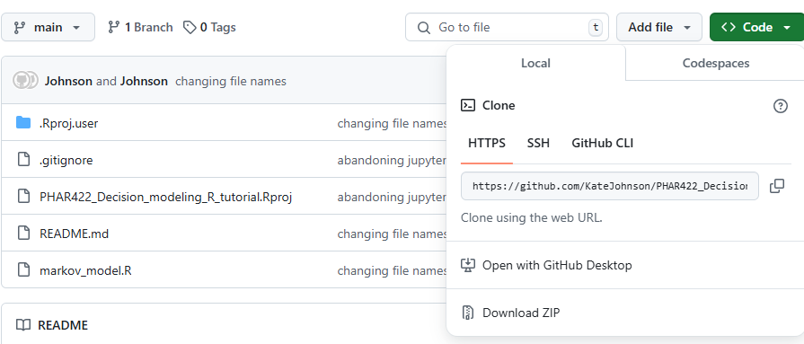

# PHAR422 Decision modeling in R tutorial (Fall 2024)

## Learning Objectives
- Construct a cohort-based Markov model in R
- Determine the ICER and display results on a cost-effectiveness plane
- Develop a probabilistic sensitivity analysis
- Characterize parameter uncertainty using a cost effectiveness acceptability curves

## Installation

We will be working on local installations of R and Rstudio. If you do not already have them downloaded on your computer, 
follow these instructions from the UBC MDS program https://ubc-mds.github.io/resources_pages/installation_instructions/. 

*Note: Select your OS and then search the document for R and R studio. You only need the first paragraph of instructions for each.

**Please do this before the start of class**

### Download a local version of this repository

- Go to https://github.com/KateJohnson/PHAR422_Decision_modeling_R_tutorial
- Under the green 'code' button (top right), 'download ZIP' to download a local copy of the entire repository and its contexts

- Unzip and open the repository from your downloads folder
- Click to open the `PHAR22_Decision_modeling_R_tutorial.Rproj` folder (in RStudio, if asked)

*Note: you may want to move the R project folder out of your downloads folder to a more logical place, such as where you store 
class materials on your computer. You can do that within finder by dragging and dropping the entire folder to your preferred location.
