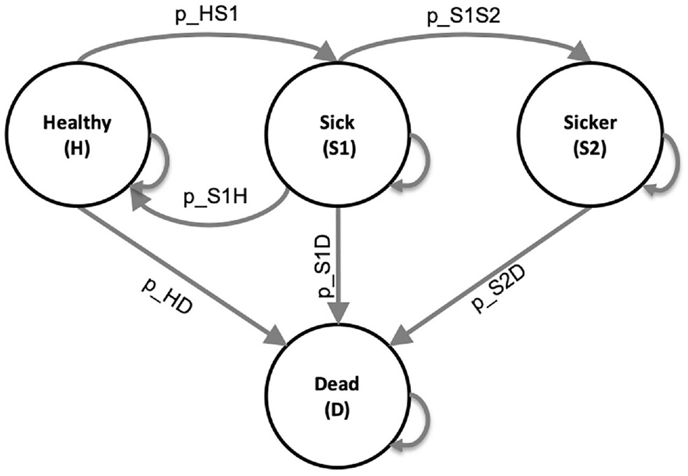
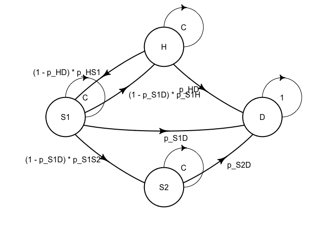
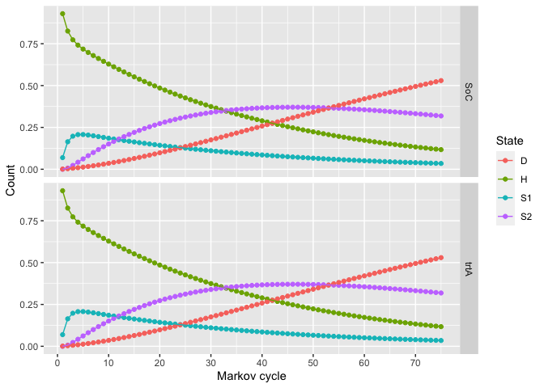
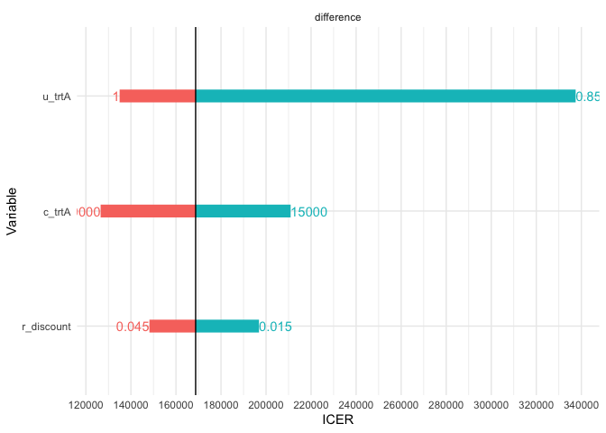

# PHAR 422: Sick-sicker Cohort Markov Model Tutorial

This example and code comes from: Alarid-Escudero F, Krijkamp EM, Enns
EA, Yang A, Hunink MGM, Pechlivanoglou P, Jalal H. [An Introductory
Tutorial on Cohort State-Transition Models in R Using a
Cost-Effectiveness Analysis
Example](https://journals.sagepub.com/doi/full/10.1177/0272989X221103163).
[Medical Decision Making](https://journals.sagepub.com/home/mdm),
2023;43(1):3-20. <https://doi.org/10.1177/0272989X221103163>

## Model description

A disease has four health states, healthy, sick, sicker, and death. In
this model, we simulate a hypothetical cohort of 25-y-olds in the
"Healthy" state (denoted "H") until they reach a maximum age of 100 y.
We will simulate the cohort dynamics in annual cycle lengths, requiring
a total of 75 one-year cycles.

Healthy individuals are at risk of developing the disease when they
transition to the "Sick" state (denoted by "S1") with an annual rate of
15 ‘sick’ cases per 100 patient years (`r_HS1`). Sick individuals are at
risk of further progressing to a more severe disease stage, the "sicker"
health state (denoted by "S2") with an annual rate of 105 ‘sicker’ cases
per 1000 ‘sick’ patient years(`r_S1S2`). Individuals in S1 can recover
and return to H, at a rate of 1 patient recovering for every 2 patients
spending a year in the ‘sick’ state (`p_S1H`). However, once individuals
reach S2, they cannot recover to either the sick (S1) or healthy (H)
states. Healthy individuals (those in H) face a constant background
mortality (`p_HD`) due to other causes of death of 0.002 per
patient-year. Individuals in S1 and S2 face an increased hazard of
death, compared with healthy individuals, in the form of an HR of 3 and
10, respectively, relative to the background mortality rate.

Individuals in S1 experience health care costs of $4,000 per year
compared to $2,000 per year for healthy individuals. Those in S2
experience annual health care costs of $15,000. The utility for the
healthy state is 1, for the sick state it is 0.75, for the sicker state
it is 0.5, and for the death state it is 0. When individuals die, they
transition to the absorbing "Dead" state (denoted by "D"). We discount
both costs and QALYs at an annual rate of 3%.

We are interested in evaluating the cost-effectiveness of strategies:
the standard of care (strategy SoC) and treatment A. Treatment A that
increases the QoL of individuals in S1 from 0.75 (utility without
treatment, `u_S1`) to 0.95 (utility with treatment A, `u_trtA`).
Treatment A costs $12,000 per year (`c_trtA`). We assume that it is not
possible to distinguish between Sick and Sicker patients; therefore,
individuals in both disease states receive the treatment. This strategy
does not affect the QoL of individuals in S2, nor does it change the
risk of becoming sick or progressing through the sick states.

Calculate the incremental cost per QALY gained.

**Sick-sicker model schematic:**



## Modeling

First we’ll load some helpful packages.

``` r
# Note the packages must first be installed with:
# install.packages("tidyverse")
# install.packages("heemod")

library(tidyverse)
```

    ── Attaching core tidyverse packages ──────────────────────── tidyverse 2.0.0 ──
    ✔ dplyr     1.1.2     ✔ readr     2.1.4
    ✔ forcats   1.0.0     ✔ stringr   1.5.0
    ✔ ggplot2   3.4.2     ✔ tibble    3.2.1
    ✔ lubridate 1.9.2     ✔ tidyr     1.3.0
    ✔ purrr     1.0.1     
    ── Conflicts ────────────────────────────────────────── tidyverse_conflicts() ──
    ✖ dplyr::filter() masks stats::filter()
    ✖ dplyr::lag()    masks stats::lag()
    ℹ Use the conflicted package (<http://conflicted.r-lib.org/>) to force all conflicts to become errors

``` r
library(heemod)
```

    Warning: package 'heemod' was built under R version 4.3.3


    Attaching package: 'heemod'

    The following object is masked from 'package:purrr':

        modify

### Defining parameters

First, define parameters based on the model description.

``` r
## Transition probabilities (annual), and hazard ratios (HRs)
r_HD <- 0.002 # annual rate of dying when Healthy (all-cause mortality rate)
r_HS1 <- 0.15 # annual rate of becoming Sick when Healthy
r_S1H <- 0.5 # annual rate of becoming Healthy when Sick
r_S1S2 <- 0.105 # annual rate of becoming Sicker when Sick
hr_S1 <- 3 # hazard ratio of death in Sick vs Healthy
hr_S2 <- 10 # hazard ratio of death in Sicker vs Healthy

# compute mortality rates
r_S1D <- r_HD * hr_S1 # annual mortality rate in the Sick state
r_S2D <- r_HD * hr_S2 # annual mortality rate in the Sicker state
```

Then we can transform all rates to probabilities by scaling by the cycle
length (1 year).

``` r
# Note: heemod also has helper functions for transformations, but for now we'll apply the formulas you learned in class
# e.g. p_HS1 <- rate_to_prob(r=r_HS1, per=cycle_length)

cycle_length <- 1

## Transitions between states
p_HS1 <- 1 - exp(-r_HS1 * cycle_length) # transition probability of becoming Sick when Healthy
p_S1H <- 1 - exp(-r_S1H * cycle_length) # transition probability of becoming Healthy when Sick
p_S1S2 <- 1 - exp(-r_S1S2 * cycle_length) # transition probability of becoming Sicker when Sick

### Transitions to death
p_HD <- 1 - exp(-r_HD * cycle_length) # annual background mortality risk (i.e., probability)
p_S1D <- 1 - exp(-r_S1D * cycle_length) # annual probability of dying when Sick
p_S2D <- 1 - exp(-r_S2D * cycle_length) # annual probability of dying when Sicker
```

Now we put all the parameters we’ve defined and some global parameters
into the form that heemod wants them in:

``` r
param <- define_parameters(
# global parameters
age_init = 25, # starting age
r_discount = 0.03, # discount rate for costs and QALYs

# transtion probabilities
p_HS1 = p_HS1,
p_S1H = p_S1H,
p_S1S2 = p_S1S2,
p_HD = p_HD,
p_S1D = p_S1D,
p_S2D = p_S2D,

## State rewards
## Costs
c_H = 2000, # annual cost of being Healthy
c_S1 = 4000, # annual cost of being Sick
c_S2 = 15000, # annual cost of being Sicker
c_D = 0, # annual cost of being dead
c_trtA = 12000, # annual cost of receiving treatment A

# Utilities
u_H = 1, # annual utility of being Healthy
u_S1 = 0.75, # annual utility of being Sick
u_S2 = 0.5, # annual utility of being Sicker
u_D = 0, # annual utility of being dead
u_trtA = 0.95 # annual utility when receiving treatment A
)
```

### Creating transition matrices

``` r
states <- c("H", "S1", "S2","D")

# transition probability matrix for strategy SoC
mat_SoC <- define_transition( 
  C, (1 - p_HD) * p_HS1, 0, p_HD,
  (1 - p_S1D) * p_S1H, C, (1 - p_S1D) * p_S1S2, p_S1D,
  0, 0, C, p_S2D,
  0, 0, 0, 1,
  state_names = states
)

# transition probability matrix for strategy A
mat_strA <- define_transition( 
  C, (1 - p_HD) * p_HS1, 0, p_HD,
  (1 - p_S1D) * p_S1H, C, (1 - p_S1D) * p_S1S2, p_S1D,
  0, 0, C, p_S2D,
  0, 0, 0, 1,
  state_names = states
)

plot(mat_SoC) # visual checks
```

    Loading required namespace: diagram

``` r
plot(mat_strA) 
```



### Defining states

``` r
## Standard of Care (SoC)
# Healthy
state_H<- define_state(
  cost = discount(c_H, r_discount),
  utility = discount(u_H, r_discount)
)
# S1
state_S1<- define_state(
  cost = discount(c_S1, r_discount),
  utility = discount(u_S1, r_discount)
)
# S2
state_S2 <- define_state(
  cost = discount(c_S2, r_discount),
  utility = discount(u_S2, r_discount)
)
# Death
state_D <- define_state(
  cost = c_D,
  utility = u_D
)

## Treatment A
# Healthy
state_H_strA <- define_state(
  cost = discount(c_H, r_discount),
  utility = discount(u_H, r_discount)
)
# S1
state_S1_strA <- define_state(
  cost = discount(c_S1 + c_trtA, r_discount),
  utility = discount(u_trtA, r_discount)
)
# S2
state_S2_strA <- define_state(
  cost = discount(c_S2 + c_trtA, r_discount),
  utility = discount(u_S2, r_discount)
)
# Death
state_D_strA <- define_state(
  cost = c_D,
  utility = u_D
)
```

### Defining strategies

``` r
## Standard of Care (SoC) 
strat_SoC <- define_strategy(
 transition = mat_SoC,
 H = state_H,
 S1 = state_S1,
 S2 = state_S2,
 D = state_D
)

## Treatment A
strat_strA <- define_strategy(
 transition = mat_strA,
 H = state_H_strA,
 S1 = state_S1_strA,
 S2 = state_S2_strA,
 D = state_D_strA
)
```

The initial distribution between states in model cycle 0 also needs to
be defined. All patients start in the healthy state. Note that in this
case we’re simulating the state transitions for only 1 patient as it
simplifies results reporting, which by convention are usually reported
as costs and QALYs *per patient*. If it’s easier you can think of the
resulting markov trace as showing the proportion of patients in each
state in each model cycle.

``` r
time0 <- define_init(H = 1, S1 = 0, S2 = 0, D = 0) # initial state vector
```

### Run the model

``` r
# run for 75 model cycles (years)
total_cycles <- 75

# model run
res_mod <- run_model(
    init=time0,
    cycles = total_cycles, 
    SoC = strat_SoC, 
    trtA = strat_strA,
    parameters = param,
    cost = cost,
    effect =  utility
  )
```

First let’s look at the markov trace showing the probability
distribution between states for each of the 75 model cycles.

``` r
# Default heemod plot giving the proportion of patients in each model cycle
plot(res_mod)
```



``` r
# The same information but as data frames for each strategy
markov_trace <- get_counts(res_mod) 

markov_trace_SoC <- markov_trace %>% 
                        rename(strategy=.strategy_names, model_cycle=model_time, state
                               =state_names, proportion=count) %>% 
                    filter(strategy=="SoC") %>% 
                    pivot_wider(names_from=state, values_from=proportion)

markov_trace_trtA <- markov_trace %>% 
                        rename(strategy=.strategy_names, model_cycle=model_time, state
                               =state_names, proportion=count) %>% 
                    filter(strategy=="trtA") %>% 
                    pivot_wider(names_from=state, values_from=proportion)
```

**\*\*Question: Are there any differences between the Markov traces for
each strategy? Why or why not?**

Now let’s look at the costs and QALYs for each model cycle in both
strategies.

``` r
cycle_payoffs <- get_values(res_mod)

cycle_payoffs_SoC <- cycle_payoffs %>% 
                          select(strategy=.strategy_names, model_cycle=model_time, payoffs
                                 =value_names, value) %>% 
                          filter(strategy=="SoC") %>% 
                          pivot_wider(names_from=payoffs, values_from=value)

cycle_payoffs_trtA <- cycle_payoffs %>% 
                          select(strategy=.strategy_names, model_cycle=model_time, payoffs
                                 =value_names, value) %>% 
                          filter(strategy=="trtA") %>% 
                          pivot_wider(names_from=payoffs, values_from=value)
```

**\*\*Question: Are there any differences between the cycle payoffs for
each strategy? Why or why not?**

Now, let’s sum the model payoffs to get total costs and QALYs for each
strategy.

``` r
## Two different ways to get total costs and QALYS for each strategy
# 1. Using our payoffs data: 
knitr::kable(cycle_payoffs_SoC %>% 
    summarise(total_cost=sum(cost), total_QALY=sum(utility)) %>% 
      mutate(strategy="SoC"))
```

<table>
<thead>
<tr class="header">
<th style="text-align: right;">total_cost</th>
<th style="text-align: right;">total_QALY</th>
<th style="text-align: left;">strategy</th>
</tr>
</thead>
<tbody>
<tr class="odd">
<td style="text-align: right;">154535.4</td>
<td style="text-align: right;">21.34647</td>
<td style="text-align: left;">SoC</td>
</tr>
</tbody>
</table>

``` r
knitr::kable(cycle_payoffs_trtA %>% 
    summarise(total_cost=sum(cost), total_QALY=sum(utility)) %>% 
      mutate(strategy="trtA"))
```

<table>
<thead>
<tr class="header">
<th style="text-align: right;">total_cost</th>
<th style="text-align: right;">total_QALY</th>
<th style="text-align: left;">strategy</th>
</tr>
</thead>
<tbody>
<tr class="odd">
<td style="text-align: right;">289954.7</td>
<td style="text-align: right;">22.14902</td>
<td style="text-align: left;">trtA</td>
</tr>
</tbody>
</table>

``` r
# 2. Looking at the default outputs of the run_model function
summary(res_mod)
```

    2 strategies run for 75 cycles.

    Initial state counts:

    H = 1
    S1 = 0
    S2 = 0
    D = 0

    Counting method: 'life-table'.

     

    Counting method: 'beginning'.

     

    Counting method: 'end'.

    Values:

             cost  utility
    SoC  154535.4 21.34647
    trtA 289954.7 22.14902

    Efficiency frontier:

    SoC -> trtA

    Differences:

         Cost Diff. Effect Diff.   ICER Ref.
    trtA   135419.3    0.8025514 168736  SoC

``` r
# Putting the incremental results in a prettier dataframe
icer <- summary(res_mod)$res_comp 

icer <- icer %>% 
            mutate(ref="SoC") %>% 
            select(strategy=.strategy_names, ref, deltaCost=.dcost, deltaEffect=.deffect,
                   icer=.icer) %>% 
            filter(strategy=="trtA")
    
knitr::kable(icer)
```

<table>
<thead>
<tr class="header">
<th style="text-align: left;">strategy</th>
<th style="text-align: left;">ref</th>
<th style="text-align: right;">deltaCost</th>
<th style="text-align: right;">deltaEffect</th>
<th style="text-align: right;">icer</th>
</tr>
</thead>
<tbody>
<tr class="odd">
<td style="text-align: left;">trtA</td>
<td style="text-align: left;">SoC</td>
<td style="text-align: right;">135419.3</td>
<td style="text-align: right;">0.8025514</td>
<td style="text-align: right;">168736</td>
</tr>
</tbody>
</table>

**\*\*Question: What is the ICER? Would you fund treatment A?**

## Sensitivity Analyses

### One-way sensitivity analysis

Let’s examine the sensitivity of our results to the following
parameters:

-   Utility of sick individuals under treatment A

-   The cost of treatment A

-   The discount rate

``` r
dsa_params <-  define_dsa (
                    u_trtA, 0.85, 1,  # define lower and upper bounds, in the base case u_trtA = 0.95
                    c_trtA, 9000, 15000, # define lower and upper bounds, in the base case c_trtA = 12000
                    r_discount, 0.015, 0.045 # define lower and upper bounds, in the base case r_discount = 0.03
                  )

# Re-run the model
res_dsa <- run_dsa(
                  model = res_mod,
                  dsa = dsa_params
)
```

    Running DSA on strategy 'SoC'...

    Running DSA on strategy 'trtA'...

Let’s look at the results in a table.

``` r
dsa_temp <- res_dsa$dsa

dsa_totals <-  dsa_temp %>% 
                      select(strategy=.strategy_names, parameter=.par_names, value=.par_value
                             , cost, utility) %>%   arrange(parameter, value)
knitr::kable(dsa_totals)
```

<table>
<thead>
<tr class="header">
<th style="text-align: left;">strategy</th>
<th style="text-align: left;">parameter</th>
<th style="text-align: left;">value</th>
<th style="text-align: right;">cost</th>
<th style="text-align: right;">utility</th>
</tr>
</thead>
<tbody>
<tr class="odd">
<td style="text-align: left;">SoC</td>
<td style="text-align: left;">c_trtA</td>
<td style="text-align: left;">15000</td>
<td style="text-align: right;">154535.4</td>
<td style="text-align: right;">21.34647</td>
</tr>
<tr class="even">
<td style="text-align: left;">trtA</td>
<td style="text-align: left;">c_trtA</td>
<td style="text-align: left;">15000</td>
<td style="text-align: right;">323809.5</td>
<td style="text-align: right;">22.14902</td>
</tr>
<tr class="odd">
<td style="text-align: left;">SoC</td>
<td style="text-align: left;">c_trtA</td>
<td style="text-align: left;">9000</td>
<td style="text-align: right;">154535.4</td>
<td style="text-align: right;">21.34647</td>
</tr>
<tr class="even">
<td style="text-align: left;">trtA</td>
<td style="text-align: left;">c_trtA</td>
<td style="text-align: left;">9000</td>
<td style="text-align: right;">256099.9</td>
<td style="text-align: right;">22.14902</td>
</tr>
<tr class="odd">
<td style="text-align: left;">SoC</td>
<td style="text-align: left;">r_discount</td>
<td style="text-align: left;">0.015</td>
<td style="text-align: right;">241780.4</td>
<td style="text-align: right;">29.21809</td>
</tr>
<tr class="even">
<td style="text-align: left;">trtA</td>
<td style="text-align: left;">r_discount</td>
<td style="text-align: left;">0.015</td>
<td style="text-align: right;">451416.6</td>
<td style="text-align: right;">30.28299</td>
</tr>
<tr class="odd">
<td style="text-align: left;">SoC</td>
<td style="text-align: left;">r_discount</td>
<td style="text-align: left;">0.045</td>
<td style="text-align: right;">106923.1</td>
<td style="text-align: right;">16.64342</td>
</tr>
<tr class="even">
<td style="text-align: left;">trtA</td>
<td style="text-align: left;">r_discount</td>
<td style="text-align: left;">0.045</td>
<td style="text-align: right;">201485.2</td>
<td style="text-align: right;">17.28144</td>
</tr>
<tr class="odd">
<td style="text-align: left;">SoC</td>
<td style="text-align: left;">u_trtA</td>
<td style="text-align: left;">0.85</td>
<td style="text-align: right;">154535.4</td>
<td style="text-align: right;">21.34647</td>
</tr>
<tr class="even">
<td style="text-align: left;">trtA</td>
<td style="text-align: left;">u_trtA</td>
<td style="text-align: left;">0.85</td>
<td style="text-align: right;">289954.7</td>
<td style="text-align: right;">21.74774</td>
</tr>
<tr class="odd">
<td style="text-align: left;">SoC</td>
<td style="text-align: left;">u_trtA</td>
<td style="text-align: left;">1</td>
<td style="text-align: right;">154535.4</td>
<td style="text-align: right;">21.34647</td>
</tr>
<tr class="even">
<td style="text-align: left;">trtA</td>
<td style="text-align: left;">u_trtA</td>
<td style="text-align: left;">1</td>
<td style="text-align: right;">289954.7</td>
<td style="text-align: right;">22.34966</td>
</tr>
</tbody>
</table>

DSA results are commonly displayed as tornado plot.

``` r
tornado_plot <- plot(res_dsa,
                     strategy = "trtA",
                     result = "icer",
                     type = "difference")

tornado_plot +
    theme_minimal() +
    scale_x_continuous(breaks = scales::pretty_breaks(n = 10)) +
    geom_vline(xintercept = icer$icer)
```

    Scale for x is already present.
    Adding another scale for x, which will replace the existing scale.



**\*\*Question: Interpret the tornado plot. Does decreasing each
parameter (utility of treatment A, cost of treatment A, and discount
rate) to its lower bound decrease or increase the ICER? How about
increasing each parameter? Which parameter is the ICER most sensitive
to?**

### Probabilistic sensitivity analysis
